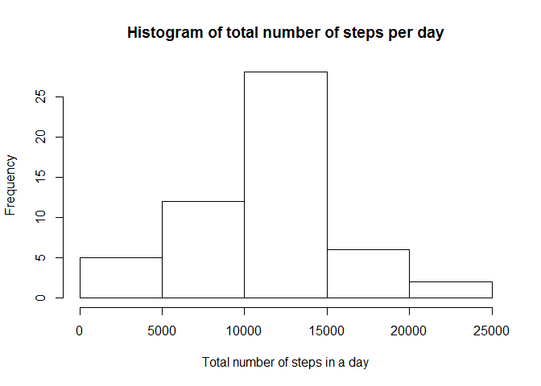
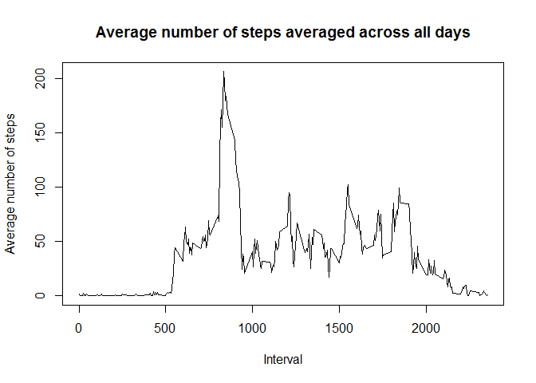
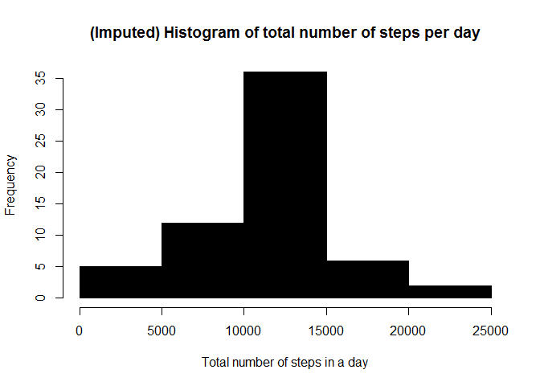
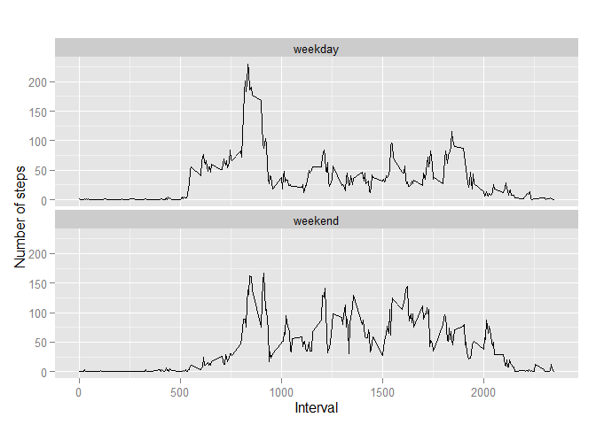

# Reproducible Research: Peer Assessment 1

Loading and preprocessing the data
----------------------------------

1. Download the activity.csv file into your pwd.
2. Read activity.csv 

```r
library(ggplot2)
library(knitr)
unzip(zipfile="activity.zip")
```

```
## Warning in unzip(zipfile = "activity.zip"): error 1 in extracting from zip
## file
```

```r
data <- read.csv("activity.csv")
```

What is mean total number of steps taken per day?
-------------------------------------------------

1. Calculate the total number of steps taken per day

```r
TotalStepsPerDay <- aggregate(steps ~ date, data, sum)
```

2. Make a histogram of the total number of steps taken each day

```r
hist(TotalStepsPerDay$steps,main="Histogram of total number of steps per day",xlab="Total number of steps in a day")
```

 

3. Calculate mean and median of the total number of steps taken per day

```r
TotalStepsPerDay_mean=mean(TotalStepsPerDay$steps)
TotalStepsPerDay_mean
```

```
## [1] 10766.19
```

```r
TotalStepsPerDay_median=median(TotalStepsPerDay$steps)
TotalStepsPerDay_median
```

```
## [1] 10765
```

What is the average daily activity pattern?
-------------------------------------------

1. Make a time series plot (i.e. type = "l") of the 5-minute interval (x-axis) and the average number of steps taken, averaged across all days (y-axis)


```r
# aggregate steps by interval to get average number of steps in an interval across all days
StepsByInterval <- aggregate(steps ~ interval, data, mean)

# generate the line plot 
plot(StepsByInterval$interval, StepsByInterval$steps, type='l', col=1, 
     main="Average number of steps averaged across all days", xlab="Interval", 
     ylab="Average number of steps")
```

 

2. Which 5-minute interval, on average across all the days in the dataset, contains the maximum number of steps?


```r
# find row id of maximum average number of steps in an interval
max_avg_steps_row_id <- which.max(StepsByInterval$steps)

# get the interval with maximum average number of steps in an interval
StepsByInterval [max_avg_steps_row_id, ]
```

```
##     interval    steps
## 104      835 206.1698
```

Imputing missing values
-----------------------

1. Calculate and report the total number of missing values in the dataset

```r
sum(is.na(data$steps))
```

```
## [1] 2304
```

2. Devise a strategy for filling in all of the missing values in the dataset. . 

3. Create a new dataset that is equal to the original dataset but with the missing data filled in.

4. Make a histogram of the total number of steps taken each day and Calculate and report the mean and median total number of steps taken per day.


```r
# perform imputation
for (i in 1:nrow(data)){
  if (is.na(data$steps[i])){
    interval_val <- data$interval[i]
    row_id <- which(StepsByInterval$interval == interval_val)
    steps_val <- StepsByInterval$steps[row_id]
    data$steps[i] <- steps_val
  }
}

# aggregate steps as per date to get total number of steps in a day
date_steps_imputed <- aggregate(steps ~ date, data, sum)

# create histogram of total number of steps in a day
hist(date_steps_imputed$steps, col=1, main="(Imputed) Histogram of total number of steps per day", xlab="Total number of steps in a day")
```

 

Do these values differ from the estimates from the first part of the assignment? What is the impact of imputing missing data on the estimates of the total daily number of steps?

Get mean and median of total number of steps per day

```r
mean(date_steps_imputed$steps)
```

```
## [1] 10766.19
```

```r
median(date_steps_imputed$steps)
```

```
## [1] 10766.19
```

New mean and median values show not much difference with the data that had NA values

Are there differences in activity patterns between weekdays and weekends?
------------------------------------------------------------------------

1. Create a new factor variable in the dataset with two levels - "weekday" and "weekend" indicating whether a given date is a weekday or weekend day.

```r
data['type_of_day'] <- weekdays(as.Date(data$date))
data$type_of_day[data$type_of_day  %in% c('Saturday','Sunday') ] <- "weekend"
data$type_of_day[data$type_of_day != "weekend"] <- "weekday"
```

2. Make a panel plot containing a time series plot (i.e. type = "l") of the 5-minute interval (x-axis) and the average number of steps taken, averaged across all weekday days or weekend days (y-axis). 

```r
# convert type_of_day from character to factor
data$type_of_day <- as.factor(data$type_of_day)

# calculate average steps by interval across all days
imputed_steps_by_interval <- aggregate(steps ~ interval + type_of_day, data, mean)

# creat a plot
qplot(interval, 
      steps, 
      data = imputed_steps_by_interval, 
      type = 'l', 
      geom=c("line"),
      xlab = "Interval", 
      ylab = "Number of steps", 
      main = "") +
  facet_wrap(~ type_of_day, ncol = 1)
```

 

